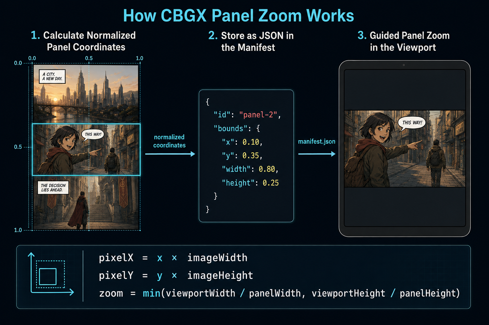

# CBGX Specification (`cbgx-spec`)

Welcome to the official specification repository for **CBGX** (**Comic Book Guided eXperience**).

CBGX is an open, platform-neutral container format (`.cbgx`) based on ZIP and JSON. It designed for digital comics, offering built-in metadata, normalized panel boundaries, and explicit reading orders for Guided View experiences.

## Repository Structure

- `specification/`: Formal specification documents for CBGX.
- `schemas/`: JSON Schema definitions (Draft 2020-12) used to validate `manifest.json`.
- `examples/`: Reference examples of valid and invalid `.cbgx` structures.
- `test-data/`: Shared test suites for SDK implementers.
- `media-type/`: Drafts for IANA MIME type registration (`application/vnd.cbgx+zip`).

> CBGX is currently an experimental format. The latest draft version is CBGX 0.1.

## Normalized Panel Coordinates

<p align="center">
  
</p>

CBGX stores panel positions as normalized coordinates instead of pixels. Normalized coordinates are independent of image resolution, screen size, operating system, and programming language. This allows the same CBGX document to be displayed consistently by .NET, Kotlin, Swift, JavaScript, and other implementations.

The coordinate system begins at the top-left corner:

- `(0, 0)` represents the top-left corner.
- `(1, 1)` represents the bottom-right corner.
- `x` and `y` define the top-left position of the panel.
- `width` and `height` define the normalized panel size.
- Values normally range from `0.0` to `1.0`.

Example:

```json
{
  "id": "panel-2",
  "bounds": {
    "x": 0.10,
    "y": 0.35,
    "width": 0.80,
    "height": 0.25
  }
}
```

The example panel:

- begins at 10% of the page width,
- begins at 35% of the page height,
- occupies 80% of the page width,
- occupies 25% of the page height.

## Conversion to Image Coordinates

A reader converts normalized coordinates into values relative to the actual source image:

```text
pixelX      = x × imageWidth
pixelY      = y × imageHeight
pixelWidth  = width × imageWidth
pixelHeight = height × imageHeight
```

For a source image measuring 2,000 × 3,000 pixels:

```text
pixelX      = 0.10 × 2000 = 200
pixelY      = 0.35 × 3000 = 1050
pixelWidth  = 0.80 × 2000 = 1600
pixelHeight = 0.25 × 3000 = 750
```

## Guided-View Zoom

The viewport is the visible rectangular area available to the reader. Its dimensions may be expressed in device-independent pixels, points, CSS pixels, or another platform-specific layout unit.

A contain-style zoom factor is calculated as follows:

```text
zoomX = viewportWidth / panelWidth
zoomY = viewportHeight / panelHeight
zoom  = min(zoomX, zoomY)
```

Using the smaller value ensures that the complete panel remains visible. The reader centers the panel in the viewport and limits the result to its supported minimum and maximum zoom levels.

An optional normalized margin may be added around the panel before calculating the zoom. The expanded rectangle must be clipped to the source image boundaries.

CBGX defines the panel geometry and reading order, but it does not require a particular UI framework:

-  **.NET/WinUI**: Supported via the official [.NET SDK](https://github.com/pixelvalley-hub/cbgx-dotnet) (utilizing APIs like `ScrollViewer.ChangeView`).
- Android may use a matrix transformation or zoomable image component.
- Swift may use `UIScrollView` or SwiftUI transformations.
- Web readers may use CSS transforms, Canvas, or WebGL.

The platform APIs may differ, but the visual result should remain equivalent.

## Reading Order

Panels are read in the order in which they occur in the page’s `panels` array. The stored array order is authoritative and must not be recalculated by the reader.

The document-level reading direction may be:

- `ltr` — left to right
- `rtl` — right to left

Reading direction helps creator applications propose an initial panel order. Readers must follow the explicitly stored order.

## Whole-Page Fallback

If a page contains no panels, the reader must display the complete page:

```json
{
  "x": 0.0,
  "y": 0.0,
  "width": 1.0,
  "height": 1.0
}
```

This ensures that every valid CBGX page remains readable when Guided View information is unavailable.


## The Key Advantage of CBGX

CBGX combines the simplicity of image-based comic archives with standardized metadata and guided panel navigation.

Unlike general-purpose publication formats, CBGX is designed specifically for digital comics. A CBGX document remains easy to create and process while providing information that traditional CBZ and CBR archives do not define.

| Feature | CBZ / CBR | EPUB | ACBF | CBGX |
|---|:---:|:---:|:---:|:---:|
| Simple image archive | Yes | No | Partially | Yes |
| Standardized metadata | No¹ | Yes | Yes | Yes |
| Explicit page order | Filename-based | Yes | Yes | Yes |
| Panel bounds | No | Possible | Yes | Yes |
| Panel reading order | No | Possible | Yes | Yes |
| Guided panel view | No | Reader-specific | Yes | Yes |
| Normalized panel coordinates | No | Percentage regions possible | Format-specific | Yes |
| Left-to-right and right-to-left reading | Reader-specific | Yes | Yes | Yes |
| Full-page fallback | Yes | Yes | Yes | Yes |
| JSON manifest | No | No | No | Yes |
| Easy validation | Limited | Complex | XML-based | Yes |
| Easy implementation | Very easy | Complex | Moderate | Easy |
| Designed specifically for comics | Informally | No | Yes | Yes |

¹ CBZ and CBR may contain additional files such as `ComicInfo.xml`, but these are conventions rather than an inherent part of the archive format.

### Positioning

> **CBGX is a simple image-based comic container with standardized metadata and guided panel navigation.**

A CBGX document uses a familiar ZIP-based structure:

```text
comic.cbgx
├── mimetype
├── META-INF/
│   └── cbgx.json
└── pages/
    ├── 0001.jpg
    ├── 0002.jpg
    └── 0003.jpg
```


## Status

CBGX 0.1 currently defines:

- metadata,
- ordered pages,
- normalized panel rectangles,
- explicit panel reading order,
- `ltr` and `rtl` reading directions,
- Guided View zoom targets,
- whole-page fallback,
- validation requirements.


## License

This specification is licensed under the [MIT License](LICENSE).
